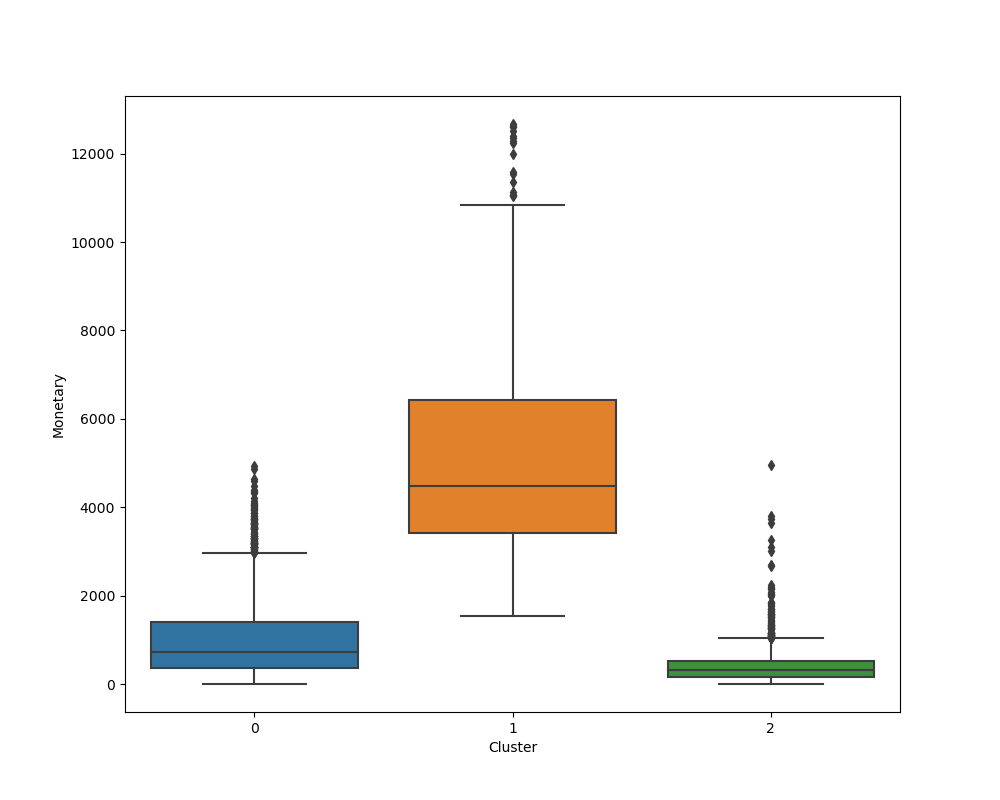

# RETAIL Clustering

K-means and hierarchical customer clustering with RFM (Recency, Frequency, Monetary) aims to segment retail customers based on their buying behavior. RFM features are engineered to quantify customer value:
recency of last purchase, purchase frequency, and monetary spent. K-means and hierarchical clustering techniques group customers with similar RFM profiles into distinct clusters, allowing retailers to identify valuable customer segments.
This enables targeted marketing, personalized promotions, and tailored strategies to retain high-value customers, re-engage inactive ones, and optimize overall business performance through enhanced customer understanding and segmentation.

## DATA
The Online Retail data used was downloaded from UCI Machine Learning Repository https://doi.org/10.24432/C5BW33 (2015)
This is a transnational data set which contains all the transactions occurring between 01/12/2010 and 09/12/2011 for a UK-based and registered non-store online retail company

## MODEL 
K-means is an iterative clustering algorithm that partitions data into K clusters by minimizing the sum of squared distances between data points and their cluster centroids (k needs to be specificed).
Hierarchical clustering creates a tree-like structure of nested clusters, either agglomeratively (bottom-up) or divisively (top-down), based on similarity measures between data points.
Both algortihms are considered to compare the approaches and results.
Both, K-means and hierarchical clustering, are apropriate for RFM analysis because they are well-suited for handling continuous data like RFM features and can efficiently segment customers into distinct groups. 

## HYPERPARAMETER OPTIMSATION
The main hyperparameter in this exercise is the number of clusters K. We applied the Elbow curve rule to decide how many clusters to use.

## RESULTS
The algorithms both identified 3 clusters in the data, Kmeans with a silhouette score of 0.51 and Hierarchical Clustering with a silhouette score of 0.45. The clusters can be described as follows:
Cluster 0 represents customers who have not made purchases recently (247.36 days on average since last purchase) and have low buying frequency (1.48 purchases on average) with moderate monetary spending ($430.63 on average). These customers might be occasional shoppers or have reduced interest in the retailer's offerings. Marketing strategies could be to try to engage them to come back - nevertheless, the profit from those customers might not be worth it so this should be kept in mind when planning the marketing strategies.
Cluster 1 represents highly active and valuable customers who made purchases recently (21.06 days on average since last purchase) and have a high frequency of purchases (12.11 purchases on average) with significantly high monetary spending ($5137.86 on average). These customers are the most loyal and contribute significantly to the retailer's revenue.
Cluster 2 represents customers with moderate recency (45.27 days on average since last purchase), moderate frequency (3.03 purchases on average), and moderate monetary spending ($997.62 on average). They may be moderately engaged or new customers, showing a balanced buying behavior.It might make sense to try to bind them with special offers/marketing efforts.

The distribution in terms of values of each feature can be seen in the boxplots below (based on K-means)

